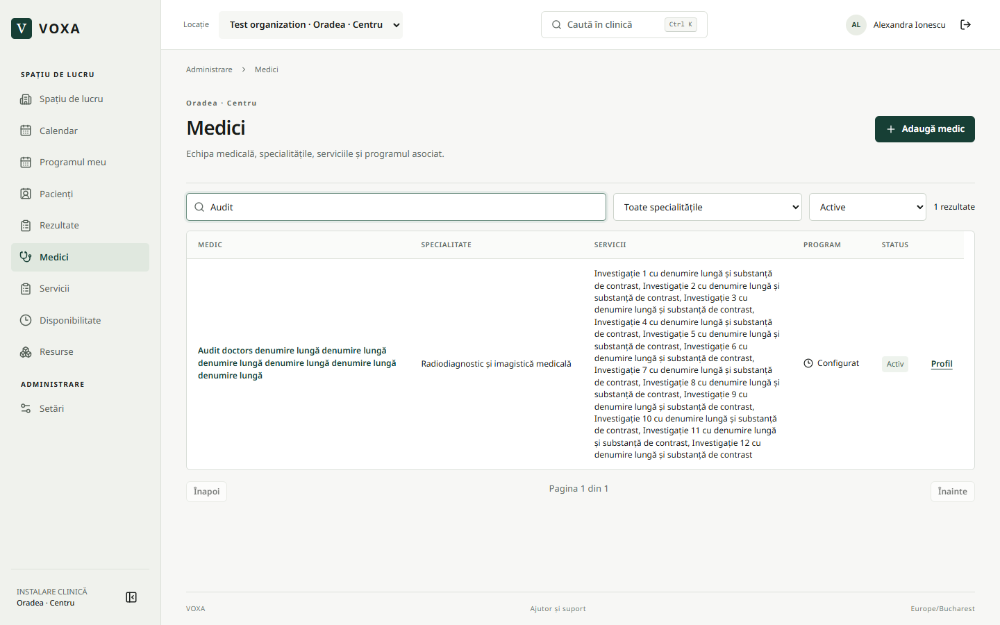
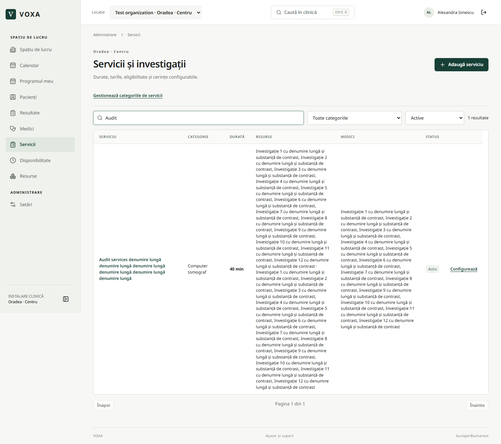
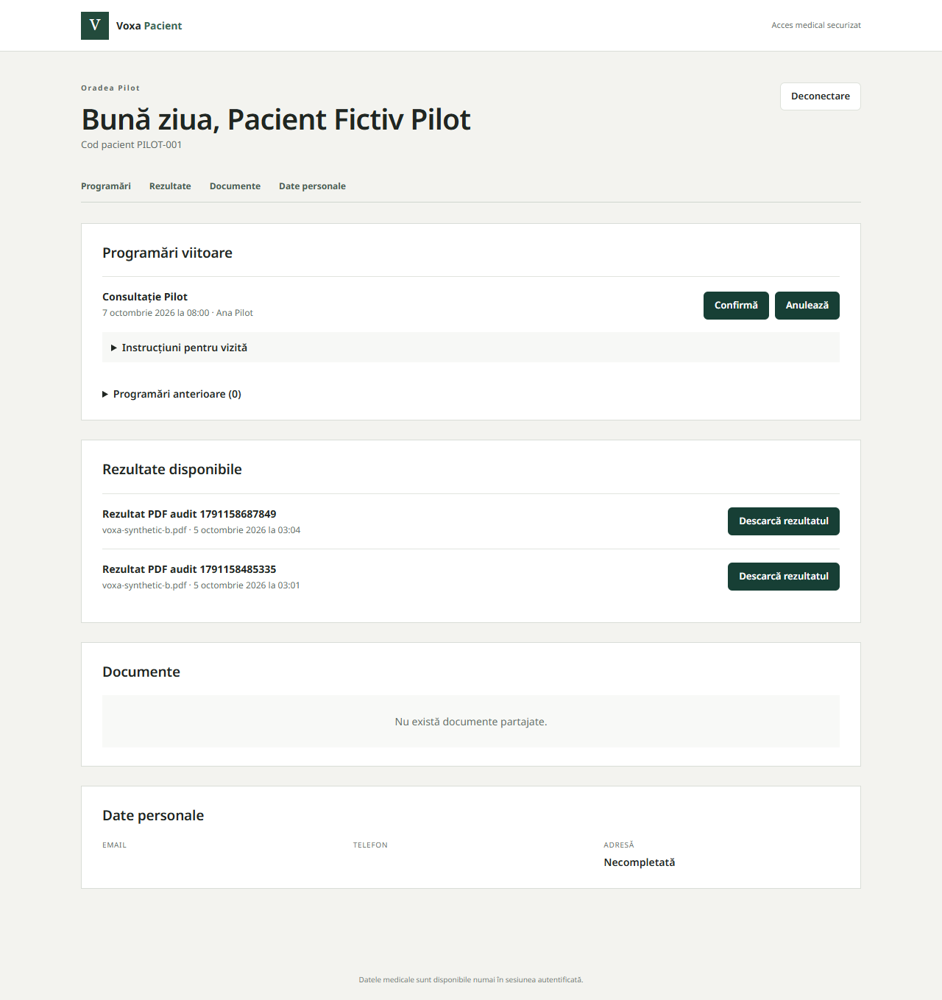

# Voxa — audit extins și flux recepție → rezultate → portal pacient

Data: 5 octombrie 2026, Europe/Bucharest. Continuă auditul de performanță documentat separat în `PERFORMANCE_AUDIT_2026-10-05.md`.

## Cerința și cauza problemelor raportate

Proprietarul a solicitat verificarea funcțiilor, textelor și afișării, după suprapuneri în registrele Medici/Servicii și o pagină indisponibilă la Rezultatele pacientului. A autorizat explicit recepția să citească toate stările rezultatelor, inclusiv cele în lucru, și să încarce rezultate pentru pacient în portal.

- Textele lungi din tabele moșteneau afișarea pe un singur rând. Celulele cu lățime limitată pictau text peste coloanele Program/Status/Acțiuni. Corecția permite împărțirea textului în interiorul celulei; acțiunile scurte rămân întregi.
- Contul raportat de proprietar are efectiv rolul RECEPTION în locația sa, nu OWNER/ADMIN. Acest rol nu avea `results.read`; verificarea serverului conducea la pagina globală indisponibilă. Migrarea 040 adaugă citirea rezultatelor, inclusiv a ciornelor, cu limitare la clinica proprie. Nu schimbă rolul contului și nu acordă drepturi de validare/publicare.

## Comportamentul final implementat

1. Recepție → Pacienți → profilul pacientului → Rezultate → **Încarcă rezultat**.
2. Titlu, PDF/PNG/JPEG/WebP valid, maximum 3 MB; verificare reală a conținutului fișierului. Tipul de document Rezultat este stabilit de server.
3. „Vizibil în portalul pacientului” este bifat inițial. Debifarea păstrează fișierul intern. Pacientul îl vede în **Rezultate disponibile** și poate descărca originalul numai dacă portalul este activat pentru identitatea sa.
4. Activarea portalului există în Prezentare, pentru un pacient cu email valid. Autentificarea pacientului folosește link securizat. Încărcarea nu trimite automat un email nou de notificare.
5. Recepția citește rapoartele redactate în toate stările; redactarea, validarea și publicarea lor păstrează drepturile medicale existente. Ciornele medicale nu devin vizibile pacientului prin noua permisiune a recepției.
6. Documentele de tip rezultat partajate anterior apar și ele în secțiunea Rezultate a portalului; nu se dublează în Documente.

Fișierele rămân în Storage privat. RPC-ul nou `list_patient_result_uploads` delegă către autorizarea documentelor existentă și păstrează verificările MFA, abonament, clinică, pacient și vizibilitate. Descărcările folosesc autorizare server și link semnat de 60 de secunde.

## Alte corecții din audit

- Secțiunile profilului pacientului respectă permisiunile; accesarea directă a unei secțiuni nepermise păstrează profilul și explică lipsa accesului.
- Rezultate apare în navigația personalului autorizat.
- Medicul unui raport nou este derivat din programarea aleasă, eliminând selectarea independentă a unui medic incompatibil.
- Starea Arhivat nu mai apare drept Activ/Inactiv; filtrul tuturor elementelor explică excluderea celor arhivate.
- Câmpurile booleene apar ca Da/Nu; tipurile programului și indisponibilităților, stările programărilor și comunicărilor au etichete românești.
- Recepția poate citi șabloanele de comunicare; editarea este prezentată numai administratorului autorizat.
- Erorile la citirea documentelor, identității portalului, programărilor, comunicărilor și portalului nu mai sunt tratate ca date lipsă.
- Butonul de reîncercare folosește mecanismul de reluare a cererii din versiunea Next.js instalată.

## Verificări executate

| Nivel | Rezultat și acoperire |
| --- | --- |
| Teste interne | **245/245**, 39 fișiere de teste; reguli, RLS, MFA, abonament, programări, roluri, fișiere, rezultate și Stripe |
| Browser local complet | **62/62**, inclusiv CRUD, onboarding, sesiuni, calendar, booking, căutare, dialoguri, responsive, billing și secțiunile pacientului |
| Regresii finale locale | **8/8** după ultimele ajustări: textul fiecărei celule rămâne între limite la 1440/1024/768/390/320 px pentru Medici/Servicii/Cabinete/Echipamente; profile OWNER/RECEPTION și șabloane read-only |
| Browser găzduit complet | **29/29**, fără omisiuni; Supabase/Storage/Auth reale, MFA, expirare, invitații, pilot fictiv, izolare și Stripe sandbox |
| Recepție → portal, versiunea finală | Test găzduit suplimentar trecut: citire ciornă de către recepție, încărcare reală, pacientul vede PDF-ul și descarcă originalul identic octet cu octet; alt pacient activ din aceeași clinică este refuzat |
| Reguli finale între pacienți | 3 teste rezultate reluate și trecute, inclusiv pacient diferit din aceeași clinică, fișier intern ascuns, MFA vechi și abonament expirat |
| Analiză și build | Lint, typecheck și build optimizat trecute |
| Schema staging/producție | Migrarea 040 aplicată; staging are 40 de migrații; ambele corespund celor **1.460 verificări structurale**. Istoricul vechi de producție este păstrat |

Rularea suplimentară a testului găzduit a identificat două greșeli în pregătirea testului, corectate: `save_core` întoarce UUID, iar un raport deja creat trebuie reutilizat la repetare. Testul final a trecut. Nu s-au eliminat constrângeri pentru a face testul să treacă.

Testele interactive folosesc date fictive. Conturile temporare ale recepției și pacienților au fost dezactivate, identitățile revocate și autentificarea blocată după test. Documentele și istoricul fictiv sunt păstrate pentru audit. Copia pre-migrare de producție a fost criptată și verificată prin decriptare: 80 tabele, zero fișiere Storage la momentul capturii. Aceasta nu închide verificarea backupului programat amânată de proprietar.

## Publicare

Migrarea și interfața sunt publicate în producție pe https://voxa-os.vercel.app. Verificarea din 5 octombrie 2026, ora 03:12 în România, confirmă deployment-ul **`dpl_9Bq6VhBjB2LT8NHJ2onmaWC6zgM2`**, **READY**, în **dub1**. Cele șapte endpoint-uri publice verificate răspund corect, inclusiv health, login, portal login și iconuri. Accesul anonim la dashboard și portal produce redirecționarea securizată către login; în Next.js aceasta poate apărea în răspunsul transmis progresiv cu status HTTP 200, nu numai ca redirect HTTP separat.

În sesiunea existentă a contului raportat, browserul real a confirmat registrul Rezultate și fila Rezultate a unui profil existent: secțiunea se afișează, butonul **Încarcă rezultat** este prezent, pagina indisponibilă nu mai apare. Verificarea live a fost numai de citire; nu s-au încărcat fișiere fictive și nu s-au modificat pacienți în producție.

Publicarea întregului checkout a fost inițial respinsă de verificarea automată din cauza schimbărilor existente. Compararea cu snapshotul deployment-ului anterior `dpl_5RhUvDF7VwpGHcAa3PzDQF4cVPvc` a demonstrat că 379 de fișiere erau identice cu producția; numai 33 diferă, toate fiind corecții/teste/documentație ale auditului. Noul mod `--audit-scope` refuză diferențe în afara listei și verifică amprentele manifestului. Publicarea limitată a fost aprobată automat și a reușit. Accesul temporar de testare staging a fost revocat la final.

## Capturi verificate vizual

## Limite și restanțe

Auditul acoperă scenariile de mai sus; nu demonstrează absența oricărui bug, capacitatea la orice volum sau conformitatea juridică. Publicarea unui rezultat încărcat cere selectarea pacientului corect și activarea portalului; nu înlocuiește verificarea clinică a fișierului.

Firma/oferta, hostingul comercial, confirmarea primei execuții programate de backup și pilotul cu o clinică reală păstrează deciziile anterioare ale proprietarului. La încheierea acestui audit, schimbările locale rămâneau de reconciliat; auditul nu a făcut commit/push/merge. Sarcina ulterioară este documentată separat în [reconcilierea release-ului](RELEASE_RECONCILIATION_2026-10-05.md), fără a prezenta testele auditului ca teste noi.
