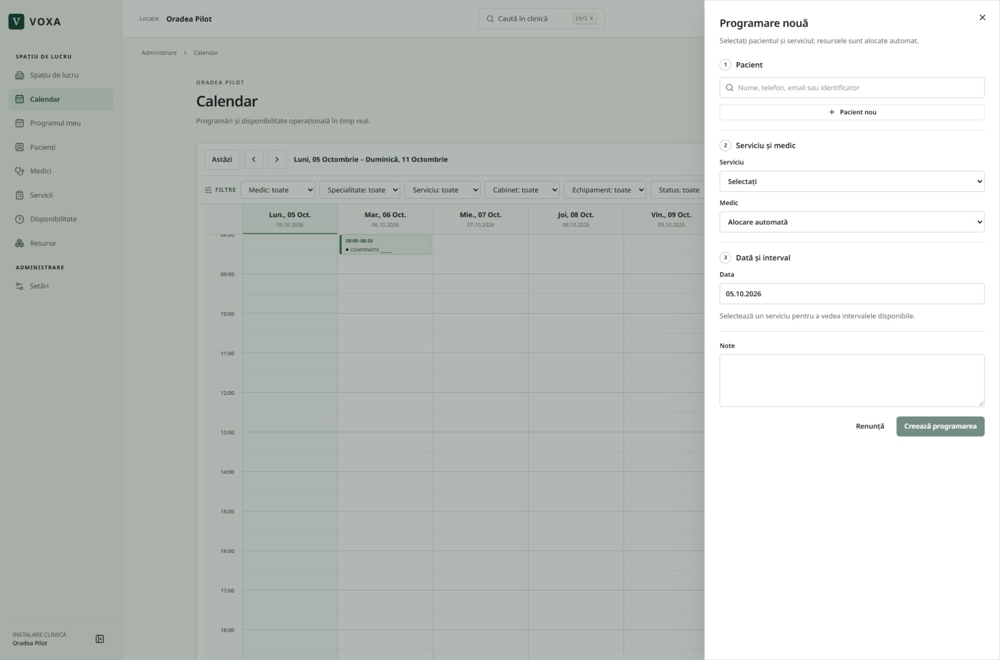

# Voxa OS — audit de performanță și funcționare, 5 octombrie 2026

Auditul pornește de la două probleme raportate: întârziere de 1–2 secunde la apăsarea butoanelor și deformarea vizuală a calendarului la închiderea formularului de programare cu X/Escape. Corecțiile au fost verificate pe o clinică fictivă în mediul separat de test. Publicarea și verificările finale sunt consemnate mai jos.

## Cauze și corecții

| Problemă găsită | Corecție |
| --- | --- |
| Serverul aplicației rula în `iad1` (SUA), în timp ce bazele de date sunt în Europa. Fiecare serie de verificări și citiri plătea latența dintre continente. | Producția folosește `dub1`, lângă baza de date din Irlanda; versiunea de test folosește `fra1`, lângă baza de date din Frankfurt. |
| Verificările de utilizator, MFA, clinică și permisiuni repetau cereri în aceeași afișare. | Verificarea din proxy folosește claims validate; paginile protejate păstrează verificarea actuală a utilizatorului. Contextul clinicii este reutilizat numai în aceeași cerere, iar permisiunea fiecărui apel se verifică separat. Factorii MFA provin din răspunsul actual Auth. |
| Calendarul aștepta salvarea preferințelor înainte să schimbe perioada/vizualizarea. | Navigarea pornește imediat. Se salvează numai modificările de vizualizare/filtre, după navigare; schimbarea datei nu trimite o salvare. Resetarea transmite explicit și filtrele goale. |
| Animația de intrare se aplica inclusiv dialogurilor care se închideau. Dialogul centrat folosea și transformări incompatibile cu poziția sa. | Închiderea elimină animația de intrare; animația de deschidere păstrează centrarea. X/Escape elimină dialogul și restabilește clicurile fără deplasarea calendarului. |
| Răspunsuri vechi puteau reapărea după altă căutare, schimbarea datei sau închiderea detaliilor. | Cererile depășite sunt anulate/ignorate în căutarea globală, programarea publică, căutarea pacienților și încărcarea detaliilor programării. |
| Alegerea altei ore pentru reprogramare solicita din nou întreaga disponibilitate și făcea lista să pâlpâie. | Selectarea orei actualizează doar selecția; disponibilitatea se recitește la schimbarea datei/medicului. |
| Căutarea unui pacient fără rezultate părea că încarcă permanent; erorile nu aveau un mesaj clar. | Sunt afișate distinct încărcarea, lipsa rezultatelor și eroarea. Deschiderea programării duplicate închide mai întâi formularul. |
| Reîmprospătarea la revenirea în fereastră putea întrerupe formularul și se declanșa de două ori. | Reîmprospătarea este temporar omisă în timpul dialogurilor și evenimentele apropiate sunt reunite. |
| Calendarul construia repetat formatatoare de dată/oră pentru carduri. | Se reutilizează numai configurațiile de formatare, fără a păstra date de clinică sau pacient. |
| Reminderele pentru mâine puteau împinge pagina în lateral la 320 px, când butonul și datele pacientului nu încăpeau pe un singur rând. | Rândul permite trecerea pe linia următoare, iar textul și butonul se încadrează în card. |
| Navigarea între secțiuni nu oferea imediat un indicator în interiorul aplicației. | Indicator de încărcare în zona de lucru, păstrând contextul meniului. |

Configurația regiunilor urmează [documentația Vercel](https://vercel.com/docs/functions/configuring-functions/region) și [lista oficială a regiunilor](https://vercel.com/docs/regions). Validarea claims în proxy și verificarea utilizatorului pentru acces protejat urmează [documentația Supabase pentru SSR](https://supabase.com/docs/guides/auth/server-side/creating-a-client).

## Măsurători înainte/după

Durata completă a răspunsului HTML autentificat, mediană din trei cereri pe pagină, aceeași clinică fictivă și același client în staging:

| Pagină | Înainte | După | Reducerea duratei |
| --- | ---: | ---: | ---: |
| Spațiul de lucru | 2.382 ms | 288 ms | 88% |
| Calendar | 1.784 ms | 264 ms | 85% |
| Pacienți | 1.249 ms | 197 ms | 84% |
| Medici | 1.470 ms | 213 ms | 86% |
| Servicii | 1.201 ms | 227 ms | 81% |
| Disponibilitate | 1.653 ms | 295 ms | 82% |
| Resurse | 1.202 ms | 412 ms | 66% |
| Setări | 998 ms | 197 ms | 80% |

Aceste cifre măsoară răspunsul serverului în mediul de test, nu toate interacțiunile și nici capacitatea sub încărcare mare. Efectele regiunii și corecțiilor din cod sunt măsurate împreună. Pornirea unui server rece, rețeaua, dispozitivul și volumul de date pot modifica timpii; nu reprezintă o garanție de latență pentru fiecare clic în producție. Bonurile brute de măsurare sunt păstrate local, în zona ignorată de Git.

În rularea finală de browser pe staging, formularul s-a deschis în 31–38 ms și s-a închis în 11–70 ms la 1440/1024/390 px. Schimbarea perioadei calendarului a durat 374 ms. Navigarea prin cele opt secțiuni a trecut fără erori JavaScript sau răspunsuri de server 5xx. Timpii browserului includ așteptările automate ale testului; sunt măsurători ale acestor scenarii, nu un benchmark universal.

## Verificări

- 242 de teste interne au trecut, inclusiv verificări MFA pentru sesiuni cu informații vechi despre înrolare/eliminare.
- Analiza statică și verificarea tipurilor au trecut. Buildul optimizat a trecut în publicarea finală pe staging.
- Browser local: suita de 54 de scenarii a identificat problema cu reminderele la 320 px (53 trecute, unul eșuat). După corecție au trecut toate cele 20 de teste reluate pentru calendar și interfață, inclusiv cazul care eșuase, cu programări și remindere prezente. Cele 54 de scenarii distincte sunt astfel acoperite; nu se pretinde o rulare integrală de 54/54 după ultima corecție CSS.
- Toate cele 28 de teste finale pe server au trecut, fără omisiuni: sesiune expirată reală, navigare, dialoguri, MFA real, clinică fictivă, acces public/protejat, separarea clinicilor, invitații/roluri și trei scenarii de Stripe/licențiere.
- Fluxurile acoperite includ autentificare, recuperare, MFA, acces pe roluri și separarea clinicilor, pacienți, medici, servicii, resurse, disponibilitate, programări/reprogramare/anulare, fișiere/PDF, căutări, setări, onboarding și abonamente.
- X și Escape au fost verificate la 1440, 1024 și 390 px. Dispariția dialogului, animația de închidere, restaurarea clicurilor și poziția calendarului sunt verificate explicit. Captura de mai jos arată calendarul după închidere, cu date fictive.
- Plățile de test sunt izolate în sandbox. Verificarea Stripe live nu taxează un client real.

## Publicare live

Corecțiile sunt publicate pe [Voxa OS](https://voxa-os.vercel.app). La 5 octombrie 2026, ora 02:26 în România, verificarea infrastructurii confirmă release-ul `dpl_5RhUvDF7VwpGHcAa3PzDQF4cVPvc`, stare `READY`, producție în `dub1` și baza de date sănătoasă în `eu-west-1`. Buildul optimizat de producție a trecut. Toate cele șase verificări publice de readiness au trecut. Faviconul, iconul SVG și iconul Apple sunt disponibile; Stripe live acceptă evenimentele live semnate și respinge evenimentele sandbox și semnăturile invalide. Niciun client real nu a fost taxat în aceste verificări.

Măsurătorile înainte/după de mai sus rămân măsurători din staging. Nu au fost prezentate drept un benchmark autentificat pe datele reale din producție.

Accesul temporar de automatizare pentru staging a fost revocat la încheiere, iar protecția publicării a rămas activă. Configurația temporară pentru testul cu token expirat a fost restaurată; producția nu a fost modificată pentru pregătirea acestui test.

## Limitele auditului

Auditul acoperă scenariile și dimensiunile testate; nu poate demonstra absența oricărui bug posibil. Nu a folosit date reale de pacient pentru testele de interacțiune și nu constituie un test de capacitate cu sute de utilizatori simultani. Modificările nu necesită migrarea bazei de date.
